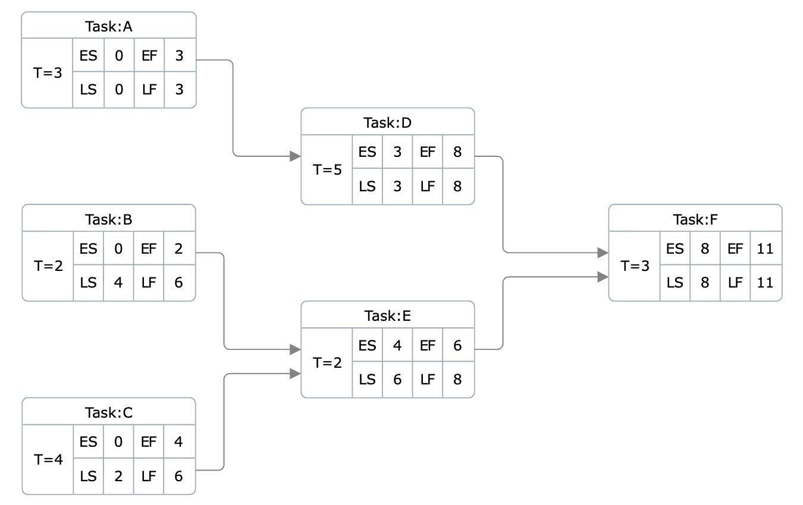

# JobScheduler

Small .NET 8 solution for the Wingie / Enuygun job scheduling case.

## Problem

The case asks for two things for a job made of dependent tasks:

- the minimum completion time for the whole job
- an order in which the tasks can be completed

Each task has:

- an id
- a duration
- zero or more dependencies on other tasks in the same job

## Chosen interpretation

The case note says the problem can have two valid answers depending on interpretation.
For this solution, I chose the following interpretation and kept it consistent everywhere in code and tests:

- tasks can run in parallel as soon as all of their dependencies are satisfied
- therefore, the minimum completion time is the length of the critical path in the dependency graph
- the returned order is one valid topological order, not a claim that tasks must run strictly one after another

I chose this approach because the wording focuses on the minimum completion time of the whole job, and once dependencies are satisfied there is no reason to delay an independent task.

## Sample case result

For the sample in the prompt:

- `A = 3`
- `B = 2`
- `C = 4`
- `D = 5`, depends on `A`
- `E = 2`, depends on `B` and `C`
- `F = 3`, depends on `D` and `E`

Under the chosen interpretation, the result is:

- minimum completion time: `11`
- one valid topological order: `A, B, C, D, E, F`
- critical path: `A -> D -> F`

### Why the result is 11 instead of 8

The case text says `8`, but under a parallel scheduling interpretation `F` cannot start until both `D` and `E` are finished.

| Task | Dependencies | Earliest Start | Duration | Earliest Finish |
| --- | --- | ---: | ---: | ---: |
| A | - | 0 | 3 | 3 |
| B | - | 0 | 2 | 2 |
| C | - | 0 | 4 | 4 |
| D | A | 3 | 5 | 8 |
| E | B, C | 4 | 2 | 6 |
| F | D, E | 8 | 3 | 11 |

Sample CPM-style view of the same task graph:



This diagram is included to make the `11` result easier to see.
It shows the earliest and latest timing values for each task, and it makes two things clear:

- `A -> D -> F` is the critical path because those tasks have no slack in this schedule
- even though `E` is done at time `6`, task `F` still cannot start before time `8` because it must also wait for `D`

`E` is ready at time `6`, but `F` still has to wait for `D`, which finishes at time `8`. After that, `F` takes `3` more units, so the total job completion time becomes `11`.

## Approach

The core problem is treated as DAG scheduling.

1. Validate the input.
   - no duplicate task ids
   - no missing dependency references
   - no negative durations
2. Build the dependency graph and in-degree map.
3. Run Kahn's algorithm to produce one valid topological order.
4. If not all tasks are processed, fail with a cycle error.
5. Walk the tasks in topological order and compute:
   - earliest start
   - earliest finish
   - predecessor on the current critical path
6. Pick the task with the largest earliest finish and backtrack to build the critical path.

Time complexity is `O(V + E)`, where:

- `V` = number of tasks
- `E` = number of dependency edges

## What the solution returns

The scheduler returns:

- `MinimumCompletionTime`
- `TopologicalOrder`
- `TaskTimings` for earliest start and earliest finish per task
- `CriticalPath`

## Running the sample

```bash
dotnet run --project JobScheduler/JobScheduler.csproj
```

Expected sample output is aligned with the chosen interpretation and reports a minimum completion time of `11`.

## Running the tests

```bash
dotnet test JobScheduler.sln
```

## Test coverage

The current test suite covers both the exact prompt and a few reasonable variations around it.

Covered scenarios:

- the prompt sample case
- the same dependency graph with different duration values
- different dependency graphs with different duration values
- all tasks independent
- a simple linear chain
- a branching and merging graph
- empty input
- a single task
- duplicate task ids
- negative duration
- cyclic dependency graph
- self-dependency
- missing dependency reference

For success cases, the tests also verify that the returned order respects dependency direction, so the assertions are not tied to one brittle exact ordering unless the graph shape makes the order deterministic.
